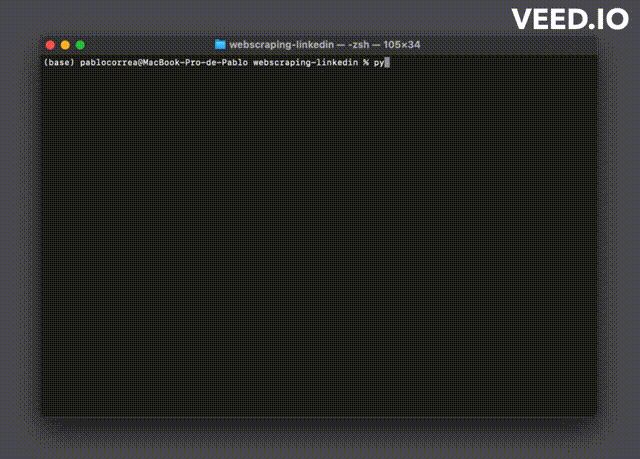

## Web Scraper - Linkedin

### Objetivo
O objetivo desta aplicação é extrair informações 
sobre as vagas remotas mais recentes disponíveis no Linkedin
na tecnologia selecionada. 

### Como utilizar?
Ao executar a aplicação na sua IDE ou no console você
irá receber uma mensagem para inserir qual tecnologia você
deseja que retorne as informações. 
Ele irá gerar um arquivo csv com as informações 
além de exibí-las na tela.

Veja no vídeo abaixo:

